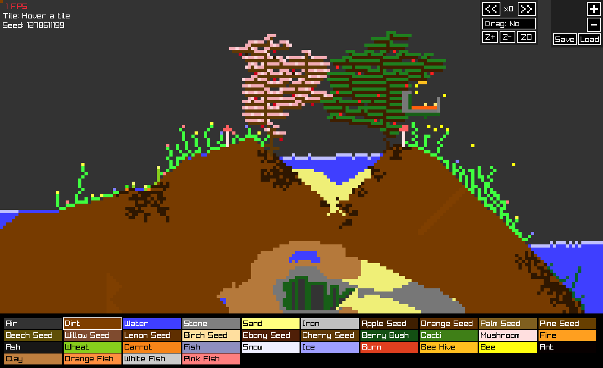

# tree
seg's garden simulator

works on linux and webassembly(and thus also on windows, mac os and phones!)
you could get it working on mac os and windows natively by changing some stuff and rebuilding raylib(`lib/libraylib.a`)

## screenshots:


## controls:
- key e: make screenshot called `screen.png`
- key a: zoom out
- key s: zoom in
- mouse wheel: change brush size
- left click: place selected tile
- right click: delete(place air)
- middle click and mouse move: move view

## build:
```sh
sh build.sh

./tree # run tree
./tree_portrait # run tree with a portrait phone size
./tree_landscape # run tree with a landscape phone size

./tree -c # run tree with the old sidebar layout
./tree -w 800 600 # run tree forcing a resolution(and ignoring the world size in include/default.h)

emrun tree.html # run tree in a web browser
```

## customize:
just change `include/default.h` and change some settings (:

## customize even more:
change `include/tree.h` and add new blocks!

## contributing:
like it? wanna add something? just make a pr!

## why the heck is everything in lowercase and with typos?
I know English(kinda, I'm from Spain), I just find it cute and funny (:
